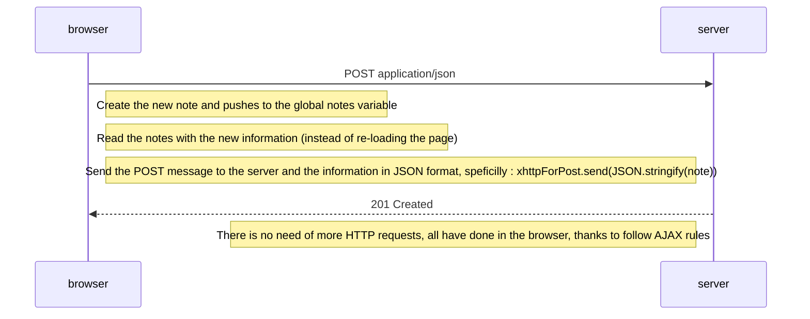

```mermaid
sequenceDiagram
    participant browser
    participant server

    browser->>server: POST application/json
    Note right of browser: Create the new note and pushes to the global notes variable
    Note right of browser: Read the notes with the new information (instead of re-loading the page)
    Note right of browser: Send the POST message to the server and the information in JSON format, speficilly : xhttpForPost.send(JSON.stringify(note))

    server-->>browser: 201 Created
    Note left of server: There is no need of more HTTP requests, all have done in the browser, thanks to follow AJAX rules
```